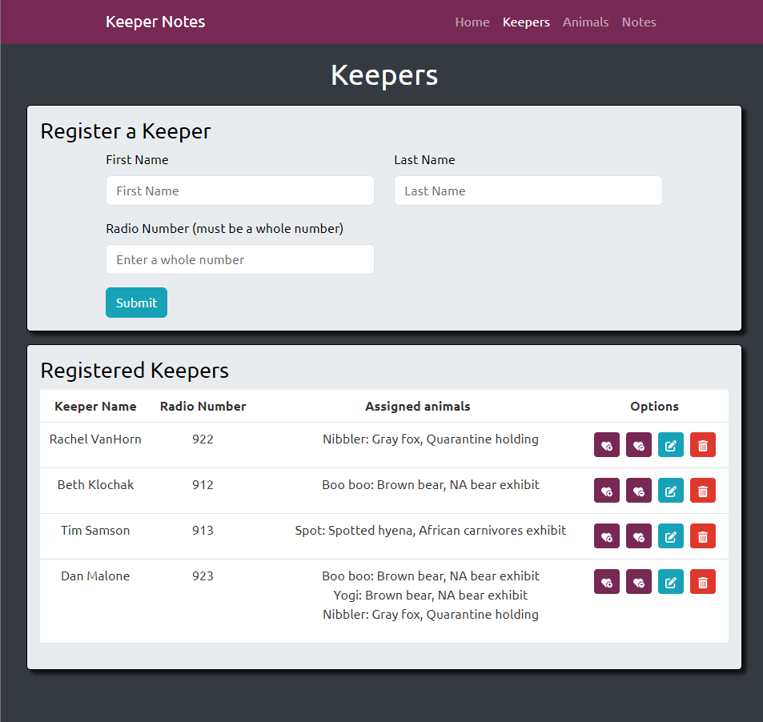
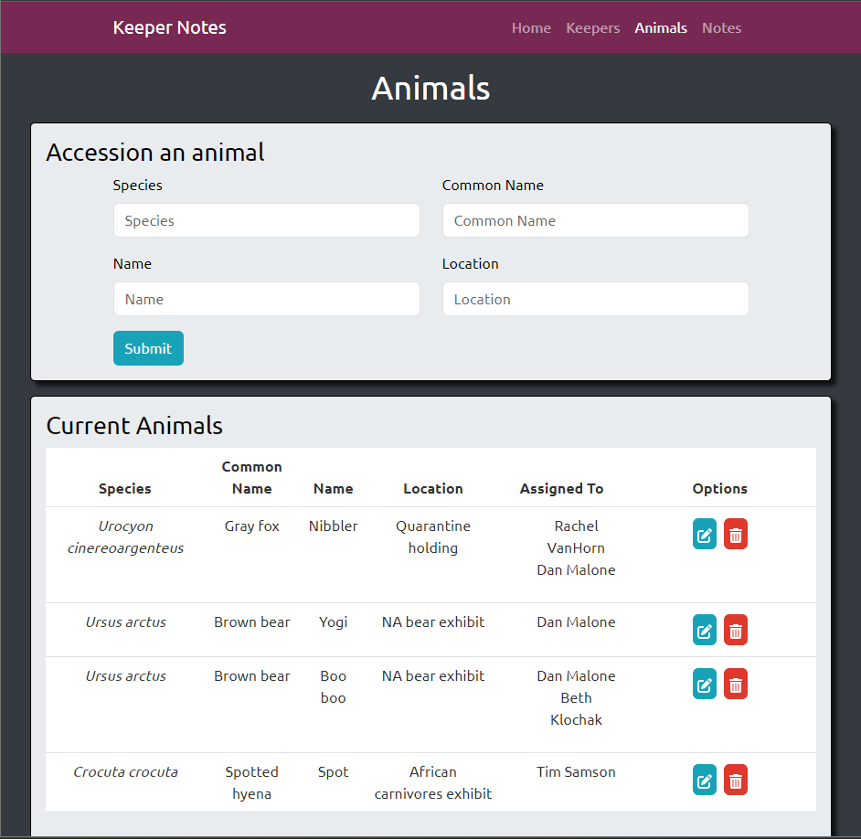
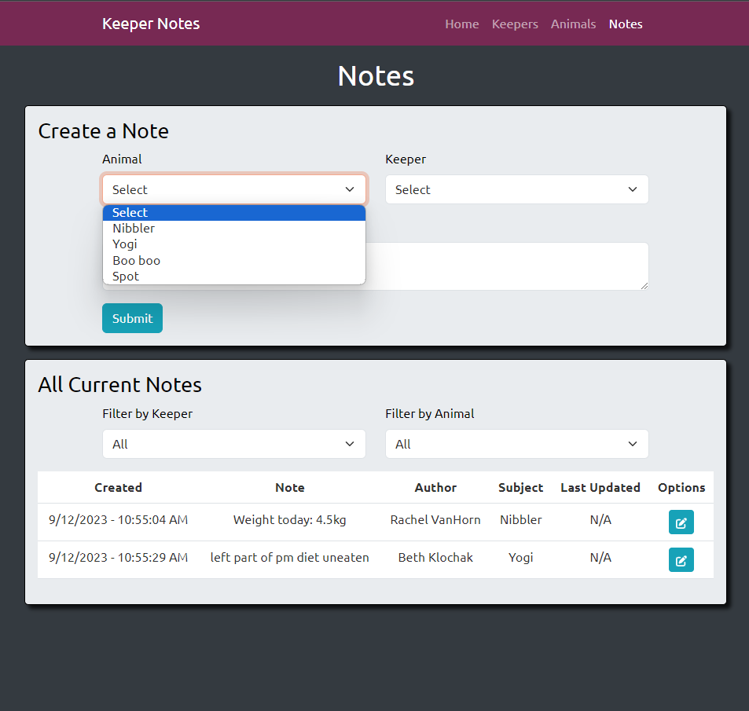
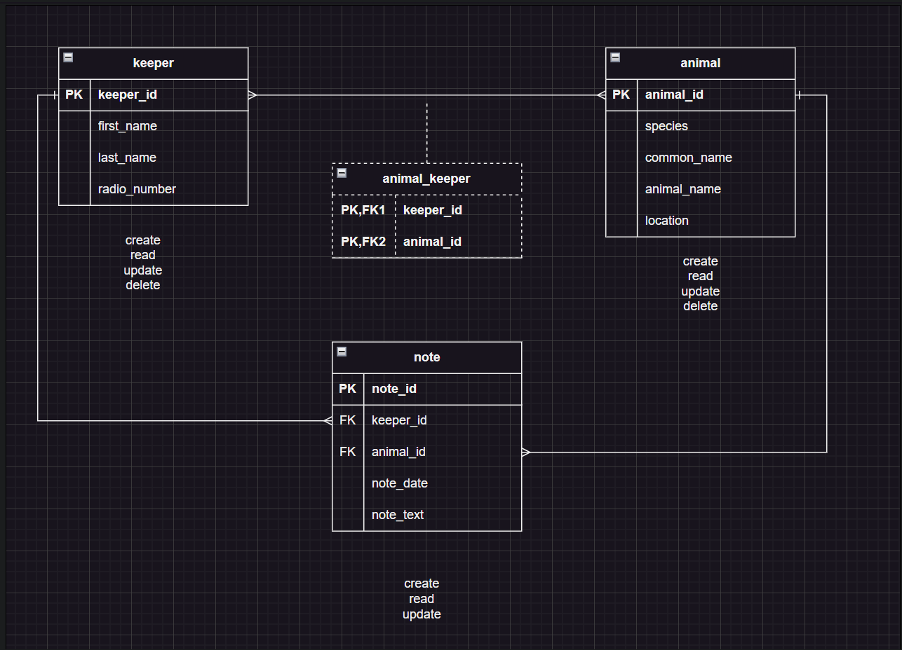

# Keeper Notes
<h3 align="center">Keeper Notes</h3>

  

    A mobile notes app for use by animal husbandry experts in zoos and animal care facilities. Built for keepers by a former keeper. 
     
     
<!--     <a href="https://rkvanhorn-livinglasvegas.netlify.app/">View Live</a> -->
  

<!-- ABOUT THE PROJECT -->
## About The Project

A comprehensive full-stack application designed for use in zoos and animal care facilities, enabling users to
execute all CRUD operations on a specifically tailored database via a user-friendly front-end client. The
application incorporates tables for keepers, animals, and notes, allowing users to register, assign, discharge,
update, and remove keepers, animals, and notes with ease and efficiency. Built using React.js, React-Bootstrap, HTML and CSS on the front end and Java with SpringBoot on the back end. 

### Built With

* [![JavaScript][Javascript.js]][Javascript-url]
* [![React][React.js]][React-url]
* [![Bootstrap][Bootstrap.com]][Bootstrap-url]
* [![Java][Java-badge]][Java-url]
* [![SpringBoot][Spring-badge]][Spring-url]

<!-- CONTACT -->
## Contact
[![LinkedIn][linkedin-shield]][linkedin-url]  

Email me at: R_VanHorn@outlook.com  

View more of my work at: https://rvanhorn.dev 

Project link: https://github.com/RKVanHorn/keeper_notes

<!-- ACKNOWLEDGMENTS 
## Acknowledgments

* 
* 
* 

(<a href="#readme-top">back to top</a>)
 -->

<!-- MARKDOWN LINKS & IMAGES -->
<!-- https://www.markdownguide.org/basic-syntax/#reference-style-links -->
[contributors-shield]: https://img.shields.io/github/contributors/github_username/repo_name.svg?style=for-the-badge
[contributors-url]: https://github.com/github_username/repo_name/graphs/contributors
[forks-shield]: https://img.shields.io/github/forks/github_username/repo_name.svg?style=for-the-badge
[forks-url]: https://github.com/github_username/repo_name/network/members
[stars-shield]: https://img.shields.io/github/stars/github_username/repo_name.svg?style=for-the-badge
[stars-url]: https://github.com/github_username/repo_name/stargazers
[issues-shield]: https://img.shields.io/github/issues/github_username/repo_name.svg?style=for-the-badge
[issues-url]: https://github.com/github_username/repo_name/issues
[license-shield]: https://img.shields.io/github/license/github_username/repo_name.svg?style=for-the-badge
[license-url]: https://github.com/github_username/repo_name/blob/master/LICENSE.txt
[linkedin-shield]: https://img.shields.io/badge/-LinkedIn-black.svg?style=for-the-badge&logo=linkedin&colorB=555
[linkedin-url]: https://linkedin.com/in/rachelkvanhorn
[product-screenshot]: LivingLasVegas.png
[CSS.js]: https://img.shields.io/badge/CSS3-1572B6?style=for-the-badge&logo=css3&logoColor=white
[CSS-url]:https://www.w3.org/Style/CSS/Overview.en.html
[Javascript.js]: https://img.shields.io/badge/JavaScript-323330?style=for-the-badge&logo=javascript&logoColor=F7DF1E
[Javascript-url]: https://developer.oracle.com/languages/javascript.html
[React.js]: https://img.shields.io/badge/React-20232A?style=for-the-badge&logo=react&logoColor=61DAFB
[React-url]: https://reactjs.org/
[Bootstrap.com]: https://img.shields.io/badge/Bootstrap-563D7C?style=for-the-badge&logo=bootstrap&logoColor=white
[Bootstrap-url]: https://getbootstrap.com
[JQuery.com]: https://img.shields.io/badge/jQuery-0769AD?style=for-the-badge&logo=jquery&logoColor=white
[JQuery-url]: https://jquery.com 
[Java-badge]: https://img.shields.io/badge/Java-ED8B00?style=for-the-badge&logo=openjdk&logoColor=white
[Java-url]: https://dev.java/
[Spring-badge]: https://img.shields.io/badge/Spring-6DB33F?style=for-the-badge&logo=spring&logoColor=white
[Spring-url]: https://spring.io/projects/spring-boot

